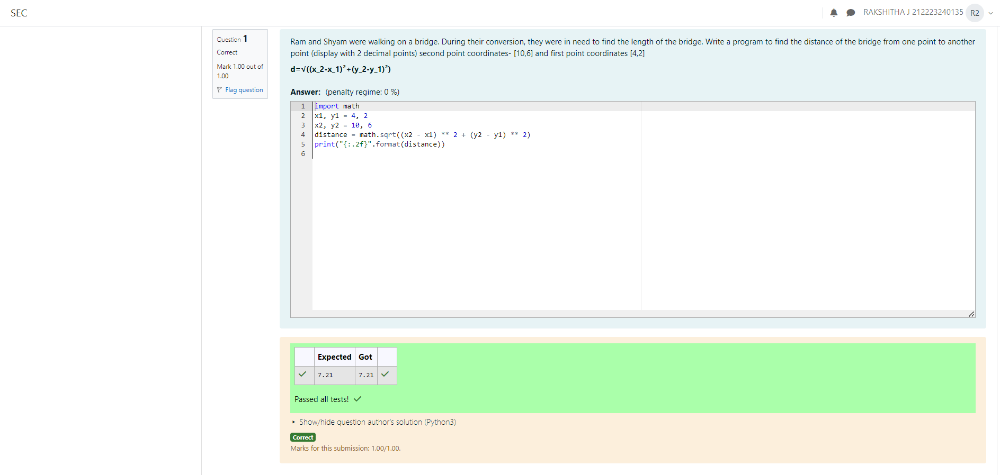

# DISTANCE-BETWEEN-TWO-POINTS

## AIM:
To write a python program to find the distance two 2 points
## ALGORITHM:

### Step 1: 
Using import math function,do the calculations.

### Step 2: 
Take the coordinates as x1 , y1, x2, y2

### Step 3: 
Substitute the values in the distance formula  

### Step 4: 
using the print function, display the distance between the two points.

### Step 5: 
End the program.
### PROGRAM:
Developed by: Rakshitha J

Register number: 212223240135

```
import math
x1, y1 = 4, 2
x2, y2 = 10, 6
distance = math.sqrt((x2 - x1) ** 2 + (y2 - y1) ** 2)
print("{:.2f}".format(distance))

```
### OUTPUT:


### RESULT:
Thus the distance of the two points is sucessfully executed and displayed.
